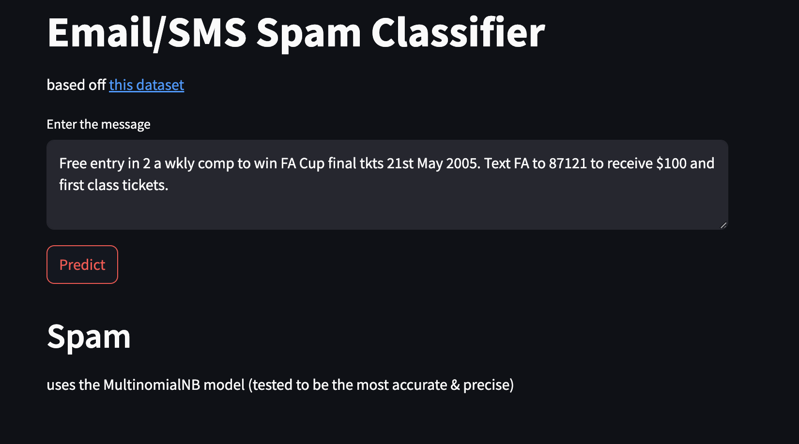
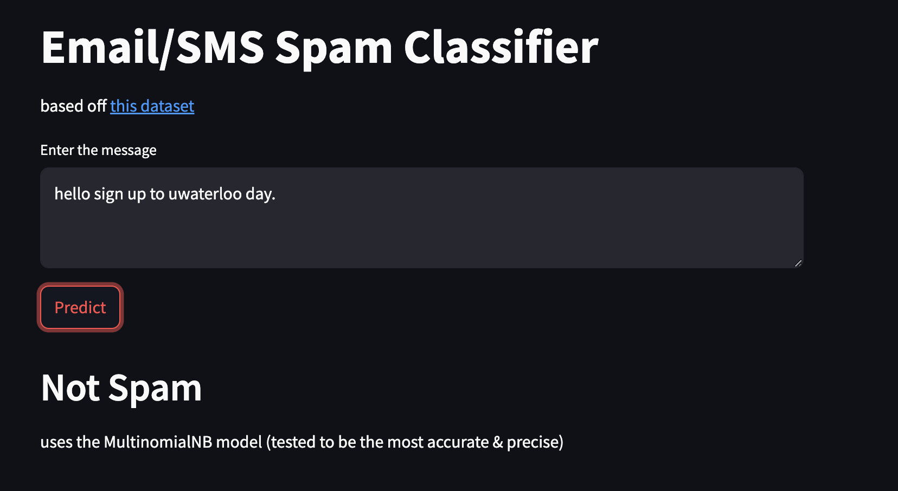

### spam classifier built with multinomialNB model from sci-kit learn w/ naive bayes methods and streamlit frontend.

#### pipeline: Data cleaning → 2. Text preprocessing → 3. Feature extraction → 4. Model training → 5. Ensemble refinement → 6. Model serialization.

1. data loading & cleaning
2. data analysis: plotting graphs & calculates basic statistics
3. preprocessing text from data, visualizes frequent words from spam / non spam messages from dataset
4. Uses tfidfvectorizer to convert processed text into numeric feature vectors
5. splits data into training (80%) and test (20%) subsets with a fixed random seed.
6. trains multiple classifiers: naive bayes variants: GaussianNB, MultinomialNB, BernoulliNB, others.
then evaluates accuracy and precision for each model on the test set & summarizes results visually using bar plots.
7. builds a VotingClassifier combining SVM, MultinomialNB, and Extra Trees (soft voting).
also builds a StackingClassifier with the same base estimators and a Random Forest as the meta-estimator.
8. chooses MultinomialNB (mnb) as the production model as its the most accurate + precise.

